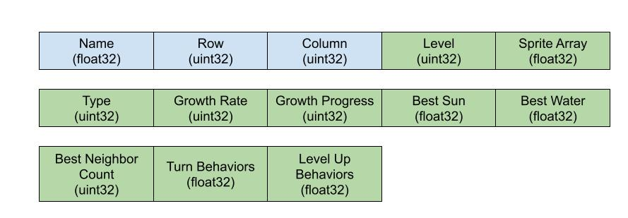

## Devlog Entry - 12/6

[Back To README](../README.md)

### How we satisfied the software requirements

**[F0.a] You control a character moving on a 2D grid.**\
Same as last week.

**[F0.b] You advance time in the turn-based simulation manually.**\
Same as last week.

**[F0.c] You can reap (gather) or sow (plant) plants on the grid when your character is near them.**\
Same as last week.

**[F0.d] Grid cells have sun and water levels. The incoming sun and water for each cell is somehow randomly generated each turn. Sun energy cannot be stored in a cell (it is used immediately or lost) while water moisture can be slowly accumulated over several turns.**\
Same as last week.

**[F0.e] Each plant on the grid has a type (e.g. one of 3 species) and a growth level (e.g. “level 1”, “level 2”, “level 3”).**\
Same as last week.

**[F0.f] Simple spatial rules govern plant growth based on sun, water, and nearby plants (growth is unlocked by satisfying conditions).**\
Same as last week.

**[F0.g] A play scenario is completed when some condition is satisfied (e.g. at least X plants at growth level Y or above).**\
Same as last week.

**[F1.a] The important state of each cell of your game’s grid must be backed by a single contiguous byte array in AoS or SoA format. Your team must statically allocate memory usage for the whole grid.**\

Each crop is represented with an array buffer for efficient data stacking.

**[F1.b] The player must be able to undo every major choice (all the way back to the start of play), even from a saved game. They should be able to redo (undo of undo operations) multiple times.**\
The player is given an undo and redo button that allows the player to move between save files, both forward and backward. If the player takes a turn after they’ve hit undo, then they will update the “most recent turn”, making it so they can’t redo back to where they were previously. The undo will take them all the way back to the start of the game.

**[F1.c] The player must be able to manually save their progress in the game in a way that allows them to load that save and continue play another day. The player must be able to manage multiple save files (allowing save scumming).**\

**[F1.d] The game must implement an implicit auto-save system to support recovery from unexpected quits. (For example, when the game is launched, if an auto-save entry is present, the game might ask the player "do you want to continue where you left off?" The auto-save entry might or might not be visible among the list of manual save entries available for the player to load as part of F1.c.)**\
The game automatically makes a save after each turn, including when the player harvests or plants crops. In the main menu, the player can select between continuing from their last save point, or starting a new game.

### Reflection
